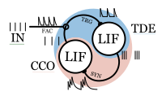

# Spiking Phase Locked Loop

The repository containing the code used in the paper "Mastella, M., Tiemens, T. & Chicca, E. _Texture Recognition Using a Biologically Plausible Spiking Phase-Locked Loop Model for Spike Train Frequency Decomposition_ **2024**. arXiv: 2403.09723 [q-bio]"
If this work helps you in your research consider citing it from here: https://arxiv.org/abs/2403.09723

## Structure
The paper is divided in four different experiments. 
### First Experiment
The first experiment shows the behaviour of a single sPLL layer against different input frequencies. 

The code generating the Figure 1 is contained in the Jupyter Notebook: [`Fig1_spll.ipynb`](https://github.com/bics-rug/sPLL/blob/master/Fig1_spll.ipynb).

In this code is also provided an incremental explanation on how the sPLL works. 

Furthermore, we show how to generate the potential well described in the paper. 

Running the code generates the two parts of the plot.

### Second Experiment
The second experiment shows instead how the architecture responds when recording from biological data from Macaque is presented. 

The code generating the Figure 2 is contained in the Jupyter Notebook: [`Fig2_bio.ipynb`](https://github.com/bics-rug/sPLL/blob/master/Fig2_bio.ipynb)

The data used for the input signals are obtained from the authors of the two following publications. 

1. Weber, A. I. et al. Spatial and temporal codes mediate the tactile perception of natural textures. PNAS 110, 17107–17112 (2013).
2. Lieber, J. D. & Bensmaia, S. J. High-dimensional representation of texture in somatosensory cortex of primates. Proc Natl Acad Sci USA 116, 3268–3277 (2019).

For accessing said data please refer to the authors of said papers.

### Third Experiment
The third experiment compare the sPLL network against a linear classifier, a LSTM, a 1-layer recurrent LIF neural network trained with backpropagation and a 2-layer recurrent neural network trained in the same way.

The different networks are trained using the same parameters but different codes. 

All codes have a training code (`*_multifreq.py`), a multiseed version (`*_multifreq_seeds.py`), a testing (`*_multifreq_finalmodel.py`). 

The resulting values of accuracy, spike number and others was then sourced by the code [`Fig3_comp.ipynb`](https://github.com/bics-rug/sPLL/blob/master/Fig3_comp.ipynb)
#### Input Dataset
The input dataset is generated using the `SPLL_dataset.py` script. 

The frequency, noise and other parameters related with said dataset are the default one for the script used.
#### sPLL
The sPLL network is simulated in the `SPLL_dataset.py` script. In this we create a dataset of responses of the sPLL for all the inputs of the dataset.

The responses are then sourced by `SPLL_notrain_multifreq.py` in which a linear classifier gets trained. The trained classifier is then saved.
This part is repeated for 20 seeds using the code `SPLL_notrain_multifreq_seeds.py`

The code `SPLL_notrain_multifreq_finalmodel.py` runs the trained model (sPLL with linear classifier) saving number of spikes in total, accuracy and other metrics for every seed.
#### Others: linear classifier,  LSTM and DSNN 
For the other networks, the data were directly pulled in the `*_multifreq.py`. `Null`, `LSTM` and `LIF` were the terms used for the linear classifier, the LSTM and the DSNN respectively.

For the DSNN the layer size was defining if the network was a single layer LIF (`50`) or a two layer LIF (`50-50`) in the argument `--layers_size`.
#### Hyperparameters Optimization
For the DSNNs the network was optimized using NNI. 

The code running the NNI can be found in the script `HPO.py`. 

The resulting optimized elements are called `LIF_multifreq_[50]_opt.txt` and `LIF_multifreq_[50-50]_opt.txt` and are sourced by the `LIF_multifreq.py` during the training. 

The dataset used to train this was created with other seeds. 

The search space can be found in `LIF_multifreq_search.txt`

### Forth Experiment
In the forth experiment, presented in the supplementary materials, the same input data of the third experiment is analyzed using an histrogram of the interspike interval and a Fourier transform. 

The code to visualize the result is [`Fig_S1_isi_vs_fft.ipynb`](https://github.com/bics-rug/sPLL/blob/master/Fig_S1_isi_vs_fft.ipynb), while the code generating it is `isi_vs_fft.py`

### Data
The resulting data can be found on: 
